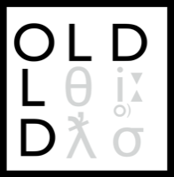

.. image:: https://travis-ci.org/dativebase/old-pyramid.svg?branch=master
    :target: https://travis-ci.org/dativebase/old-pyramid

================================================================================
  The Online Linguistic Database (OLD)
================================================================================

The Online Linguistic Database (OLD) is software for linguistic fieldwork. It
helps groups of linguists, language documenters, and/or language community
members to collaboratively build a web-accessible database of their language
data.

Features
================================================================================

- Multi-user database creation
- Advanced search
- Automatic morpheme cross-referencing
- Configurable validation
- Morphological parser & phonology builder
- Text creation
- User access control
- Documentation
- Open source
- Graphical User Interface: Dative
- RESTful JSON API

For additional information, see the `OLD Web Site`_.

`Dative`_ is a GUI for the OLD. See the `Dative source code`_, `Dative's web
site`_, or the `Dative app`_ for more information.

Installation
===============================================================================

Docker
-------------------------------------------------------------------------------

The OLD comes with a Dockerfile that can install and run the OLD on a docker
container. *Warning*: this is still under development. First install docker.
Then move to the directory containing the Dockerfile file and build the docker
image by running::

    $ docker build -t old:v1 .

Then run the container::

    $ docker run -d -p 8001:6543 old:v1

Now an OLD should be available at http://127.0.0.1:8001.

Install via Vagrant/Ansible
-------------------------------------------------------------------------------

The easiest way to install the OLD and all of its dependencies (as well as
Dative) is to do so on a virtual machine using the `Dative/OLD Vagrant/Ansible
deploy scripts`_::

    $ git clone git@github.com:dativebase/deploy-dative-old.git
    $ cd deploy-dative-old/playbooks/dative-old
    $ ansible-galaxy install -f -p roles/ -r requirements.yml
    $ vagrant up

The above commands assume you have Vagrant (>= 1.7) installed and Ansible (v.
2.1.1.0) installed. These commands will install the OLD and its dependencies
(foma, MITLM, ffmpeg, TGrep2) on a virtual machine running Ubuntu 14.04; they
will configure and serve two OLD instances as well as the Dative GUI.

Manual Install
-------------------------------------------------------------------------------

To install the OLD manually from source, create and activate a Python3 virtual
environment, clone the OLD source, and use pip to install its dependencies::

    $ virtualenv -p /path/to/python3/executable env
    $ source env/bin/activate
    $ git clone git@github.com:dativebase/old-pyramid.git
    $ cd old-pyramid
    $ pip install -r requirements.txt -e .

Build the Database Tables
===============================================================================

Modify the config file (config.ini) to your liking, choosing SQLite or MySQL as
RDBMS and supplying appropriate values for the database name, user, etc. Then
create the database tables and directory structure::

    $ initialize_old_db config.ini

Serve the OLD
===============================================================================

You can use `pserve`_ to serve the OLD::

    $ pserve config.ini

Alternatively, use the serve.sh convenience shell script, providing host and
port values as environment variables, if desired::

    $ OLD_PORT=62008 ./serve.sh

Now if you navigate to http://localhost:62008/old/ you should see a big JSON
object that describes the OLD's API. If you install `Dative`_, you can use it to
interact with the OLD.

Environment Variable Configuration
===============================================================================

Serving the OLD and building its database tables requires configuration which
can come from directly modifying the config file (config.ini) or from setting
specific environment variables. The latter approach is recommended and the
following environment variables are recognized by the OLD. See the comments in
the config file for what is expected in these variables.

- ``OLD_DB_RDBMS``
- ``OLD_DB_USER``
- ``OLD_DB_PASSWORD``
- ``OLD_DB_HOST``
- ``OLD_DB_PORT``
- ``OLD_DB_DIRPATH``
- ``OLD_TESTING``
- ``OLD_NAME_TESTS``
- ``OLD_CREATE_REDUCED_SIZE_FILE_COPIES``
- ``OLD_PREFERRED_LOSSY_AUDIO_FORMAT``
- ``SQLALCHEMY_POOL_RECYCLE``
- ``OLD_PERMANENT_STORE``
- ``OLD_ADD_LANGUAGE_DATA``
- ``OLD_EMPTY_DATABASE``
- ``OLD_PASSWORD_RESET_SMTP_SERVER``
- ``OLD_TEST_EMAIL_TO``
- ``OLD_GMAIL_FROM_ADDRESS``
- ``OLD_GMAIL_FROM_PASSWORD``

Technical
================================================================================

The OLD is software for creating OLD instances, RESTful web services that send
and receive data in JSON format. It is written in Python using the `Pyramid web
framework`_. It works with both MySQL and SQLite as the RDBMS.

Note: this is the OLD written using the `Pyramid`_ framework and is the version
that will be used for current and future development. For the `Pylons`_
framework OLD, see the `Pylons OLD source`_ and the `Official OLD
Documentation`_.

For Developers
================================================================================

To run tests you must have MySQL v. 5.6 or greater installed. (The tests are
not guaranteed to pass currently with SQLite or earlier versions of MySQL.) If
MySQL is installed, make sure that the MySQL database and user corresponding to
your configuration exist. For example, if your testing configuration expects a
database named ``oldtests`` accessible to the user ``old`` with password
``demo``, do the following::

    mysql> CREATE DATABASE oldtests
        DEFAULT CHARACTER SET utf8
        DEFAULT COLLATE utf8_bin;
    mysql> CREATE USER 'old'@'localhost' IDENTIFIED BY 'demo';
    mysql> GRANT ALL PRIVILEGES ON oldtests.* TO 'old'@'localhost';

Make sure that your configuration matches your test database, i.e., modify the
config file to have appropriate corresponding values, e.g., ``db.user = old``,
or, better yet, set the corresponding environment variables e.g.,
``OLD_DB_USER=old``. Also, make sure to turn testing on in the configuration:
``OLD_TESTING=1``.

Then run the tests::

    $ pytest

The convenience script test.sh will turn testing on for you and will then run
the tests::

    $ ./test.sh

The tests can also be run with tox using specific Python versions::

    $ tox -e py34
    $ tox -e py35
    $ tox -e py36

To run all tests across all supported Python versions, including the pylint
linting tests::

    $ tox

.. _`OLD Web Site`: http://www.onlinelinguisticdatabase.org/
.. _`Official OLD Documentation`: http://online-linguistic-database.readthedocs.org/en/latest/
.. _`Dative`: http://www.dative.ca/
.. _`Dative source code`: https://github.com/dativebase/dative
.. _`Dative's web site`: http://www.dative.ca/
.. _`Dative app`: http://app.dative.ca/
.. _`Pyramid web framework`: http://www.pylonsproject.org/
.. _`Pyramid`: https://trypyramid.com/
.. _`Pylons`: http://upcoming.pylonsproject.org/about-pylons-framework.html
.. _`Pylons OLD source`: https://github.com/dativebase/old
.. _`Dative/OLD Vagrant/Ansible deploy scripts`: https://github.com/dativebase/deploy-dative-old
.. _`pserve`: https://docs.pylonsproject.org/projects/pyramid/en/latest/pscripts/pserve.html
